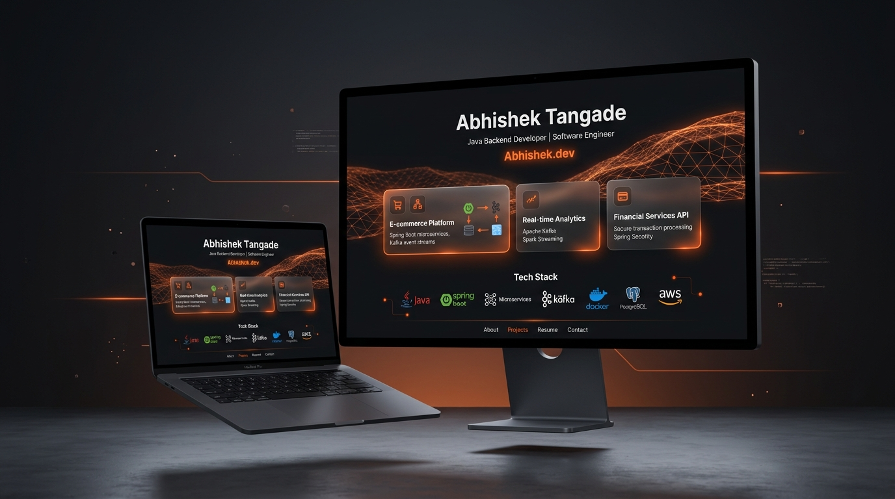

# 🚀 Abhishek Tangade — Enterprise Java Backend Developer Portfolio

A modern, production-grade personal portfolio website showcasing distributed microservices architecture, event-driven design, and high-performance WebGL aesthetics.

[](https://abhishektangade-portfolio.netlify.app/)
[](https://www.oracle.com/java/)
[](https://spring.io/projects/spring-boot)
[](https://kafka.apache.org/)
[](https://redis.io/)

---

## 🎬 Live Demo & Portfolio Showcase



> 💡 **Interactive Live Demo Page**: Experience the automated live scrolling preview, dark/light theme switchers, and microservice sequence diagrams at [**demo.html**](https://abhishektangade-portfolio.netlify.app/demo.html).

---

## ✨ Enterprise Features & Technical Highlights

### ⚡ Architectural Mastery
- **Delivo OS — Food Delivery Microservices**: Built using **8 Spring Boot microservices** orchestrating asynchronous orders via **Apache Kafka Saga Patterns** and **Redis cache failovers**, delivering a **45% reduction in API response latency**.
- **SmartBank — Digital Banking Platform**: Implemented **30+ secure REST APIs** with **Spring Security 6 stateless JWT authentication** and strict **ACID ledger consistency** benchmarked across **10K+ simulated transaction loads**.
- **Interactive Sequence Flow Diagrams**: Built-in **Mermaid.js** sequence diagrams embedded directly inside project case study modals.
- **OpenAPI / Swagger Integration**: Direct links to full OpenAPI / Swagger specifications for live endpoint exploration.

### 🎨 Visual & Performance Engineering
- **Stripe / Linear Editorial Layout**: Desktop split-grid presentation featuring a studio headshot portrait card and an authentic coding workspace setup.
- **WebGL Ambient Shader Canvas**: High-performance fragment shader with octave noise (`fbm`), cursor parallax, and scroll velocity coupling.
- **Dual Dynamic Theme Architecture**: 
  - **Dark Mode**: Pitch-black (`#0D0D0D`) theme with signature orange (`#FF4D00`) accents.
  - **Light Mode**: Translucent 3D animated flowing silk backdrop (`#FAFAF7`) with 24-second keyframe ambient loops.
- **Interactive Command Palette (`⌘K`)**: Desktop shortcut to search skills, jump between sections, or launch case studies.

---

## 🛠️ Tech Stack & Dependencies

| Area | Technologies & Tools |
| :--- | :--- |
| **Backend Core** | Java 21, Spring Boot 3.x, Spring Data JPA, Hibernate, JUnit 5 |
| **Distributed Systems** | Apache Kafka, Microservices Architecture, Saga Orchestration, API Gateway |
| **Security & Database** | Spring Security 6, JWT, MySQL 8, Redis Cache Failover |
| **Frontend & UI** | HTML5, Vanilla CSS3 (Custom Variables), JavaScript (ES6+), GSAP, Lenis Smooth Scroll |
| **Graphics & Shaders** | WebGL 2D/3D Fragment Shaders, Canvas API, Mermaid.js, Font Awesome 6 |

---

## 📁 Repository Structure

```
Portfolio/
├── index.html                  # Main Fullscreen Hero Showcase & Overview
├── about.html                  # Career Story, Workspace Photo Card, & BCA Education
├── skills.html                 # Categorized Skills Matrix & Filtering
├── projects.html               # Enterprise Bento Showcase, Modals & OpenAPI Specs
├── resume.html                 # Interactive Resume & Download PDF
├── contact.html                # Contact Form & OpenStreetMap Embed
├── demo.html                   # Interactive Animated Portfolio Demo Showcase Page
├── 404.html                    # Custom 404 Error Page
├── assets/
│   ├── css/
│   │   ├── style.css           # Design System Tokens & Dual Theme Engine
│   │   └── animations.css      # Keyframe Motion & Micro-interactions
│   ├── js/
│   │   ├── main.js             # Navigation, Modals, Theme Sync, & ⌘K Logic
│   │   ├── animations.js       # GSAP & ScrollTrigger Animations
│   │   └── lightning.js        # WebGL Octave Shader Background Canvas
│   ├── images/
│   │   ├── abhishek-hero-portrait.jpg     # 8K Studio Portrait Headshot
│   │   ├── abhishek-about-workspace.jpg    # Workspace Coding Setup Photo
│   │   └── portfolio-showcase.jpg          # 16:9 3D Promotional Banner
│   └── resume/
│       └── Abhishek_Tangade_Resume.pdf    # Downloadable 1-Page PDF Resume
├── favicon.png                 # 3D Metallic Monogram Favicon
├── robots.txt                  # Search Engine Crawler Guidance
├── sitemap.xml                 # Canonical XML Sitemap
├── server.js                   # Local Node.js Preview Server (Port 5501)
└── run_local.bat               # Windows One-Click Local Server Launcher
```

---

## 💻 Running Locally

### Option 1: One-Click Launcher (Windows)
Double-click `run_local.bat` to launch the local Node.js server and open `http://localhost:5501/` automatically.

### Option 2: Node.js CLI
```bash
# Clone the repository
git clone https://github.com/abhishektangade965-crypto/Portfolio.git

# Navigate to project directory
cd Portfolio

# Start local server
node server.js
```
Open **[http://localhost:5501/](http://localhost:5501/)** in your browser.

---

## 🌐 Deploying to Netlify / Vercel

1. Push your changes to GitHub:
   ```bash
   git add .
   git commit -m "Deploy production build"
   git push -u origin main
   ```
2. Connect your repository to **Netlify** or **Vercel**.
3. Set the publish directory to `./` (No build command required).
4. Netlify will automatically detect `data-netlify="true"` form submissions on `contact.html`.

---

## 📄 License & Copyright

© 2026 **Abhishek Tangade**. All rights reserved.  
Built with HTML5, CSS3, WebGL, GSAP & Vanilla JavaScript.
